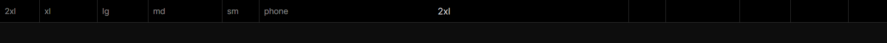

<div align="center">
  <h1>react-breakpoint-visualizer</h1>
</div>

---
**React Breakpoint Visualizer** is designed to display the responsive breakpoint for your react application.

If you are using tailwindcss with dark classes, this should also have dark mode enabled. 

*Preview of the widget at the top of a page in dark mode*

<div align="center">
  
</div>

---
## Usage

### Installation

You can install **`react-breakpoint-visualizer`** using npm:

```
npm install react-breakpoint-visualizer
```

### Importing

Once you've installed the package, you can import the **`BreakpointVisualizer`** component.

```jsx
import { BreakpointVisualizer } from 'react-breakpoint-visualizer';
```

Finally add it at the very top of your render tree inside your body tag.

```jsx
<BreakpointVisualizer
  breakpoints={{
    phone: 0,
    sm: 640,
    md: 768,
    lg: 1024,
    xl: 1200,
    "2xl": 1400,
  }}
/>
```

The above is the configuration used for the preview image above.

---
## Dependencies
- "react": "^18.2.0"
- "use-breakpoint": "^3.1.1"
- "tailwindcss": "^3.3.3"

## License

React Breakpoint Visualizer is ISC licensed.

<a href="https://www.buymeacoffee.com/alexvencel" target="_blank"></a>
